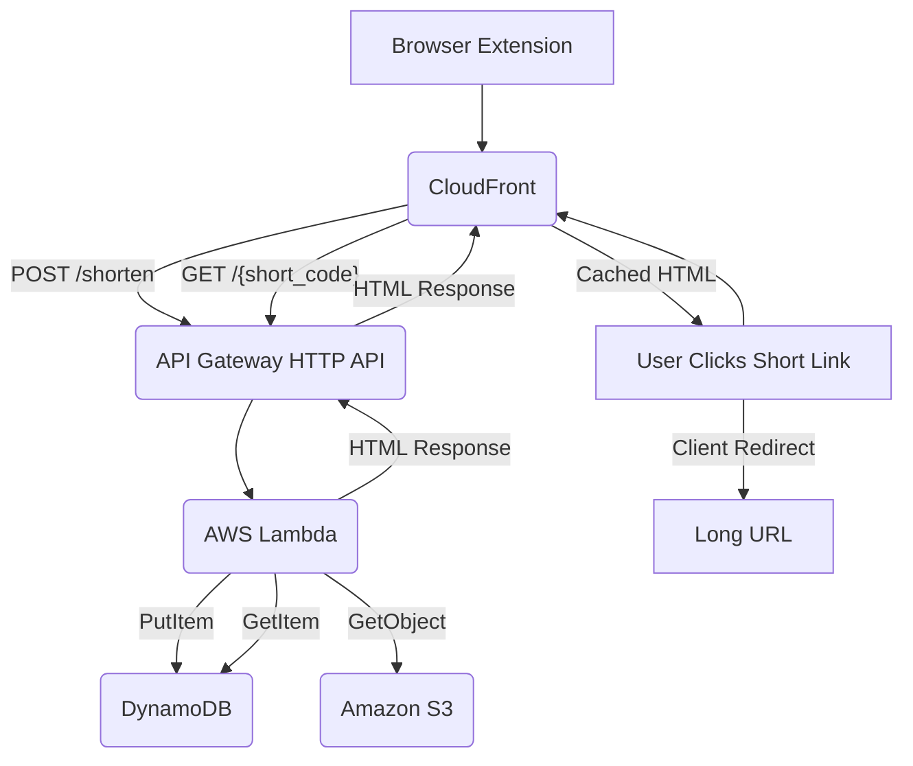
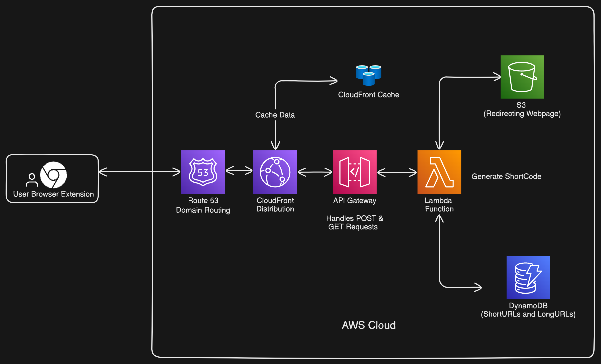

# Shortify: A Serverless URL Shortener Browser Extension

Shortify is a full-stack serverless URL shortening solution built on AWS, featuring a browser extension for easy link creation and leveraging CloudFront for fast redirects via a custom domain.

## Features

* **Browser Extension:** Easily shorten the current tab's URL directly from your browser.
* **Fast Shortening:** Uses AWS Lambda and API Gateway for quick link creation.
* **Rapid Redirects:** Leverages CloudFront and S3 for low-latency redirects globally.
* **Custom Domain:** Operate the shortener using your own domain (e.g., `thexeon.tech`).
* **Serverless Architecture:** Scales automatically, pay-per-use, minimal operational overhead.
* **Scalable Storage:** Utilizes DynamoDB for storing URL mappings.
* **Client-Side Redirect:** Employs a static HTML page from S3 for efficient redirects.

## Architecture Overview

The Shortify architecture involves several AWS services:

1.  **Browser Extension:** The client-side component running in the user's browser. It interacts with the API Gateway endpoint to shorten URLs.
2.  **Amazon CloudFront:** Acts as a Content Delivery Network (CDN) and sits in front of the API Gateway. It caches redirect responses (`GET /{short_code}`) at edge locations and forwards shortening requests (`POST /shorten`) to the API Gateway. It also handles HTTPS and redirects HTTP traffic.
3.  **Amazon API Gateway (HTTP API):** Provides the public HTTP endpoints for the application (`/shorten` and `/{short_code}`). It triggers the Lambda function.
4.  **AWS Lambda:** Contains the core logic.
    * Handles `POST /shorten`: Generates a unique short code, stores the mapping in DynamoDB, and returns the short URL.
    * Handles `GET /{short_code}`: Looks up the short code in DynamoDB, fetches a redirect HTML template from S3, replaces a placeholder with the long URL, and returns the modified HTML.
5.  **Amazon DynamoDB:** A NoSQL database used to store the mapping between short codes and long URLs.
6.  **Amazon S3:** Hosts the static `redirect.html` file used for client-side redirects.


### AWS Architecture Diagram


### Required Policies

Bucket Policy - Replace YOUR_BUCKET_NAME
```json
{
    "Version": "2012-10-17",
    "Statement": [
        {
            "Sid": "PublicReadGetObject",
            "Effect": "Allow",
            "Principal": "*",
            "Action": "s3:GetObject",
            "Resource": "arn:aws:s3:::YOUR_S3_BUCKET_NAME/*"
        }
    ]
}

